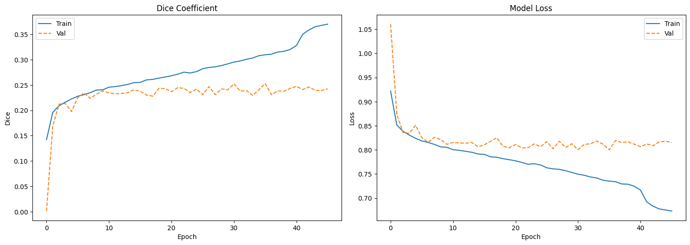
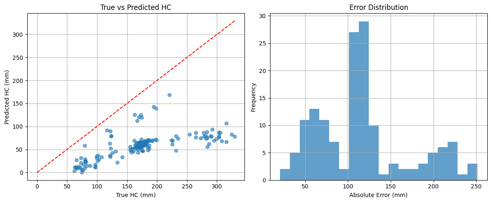
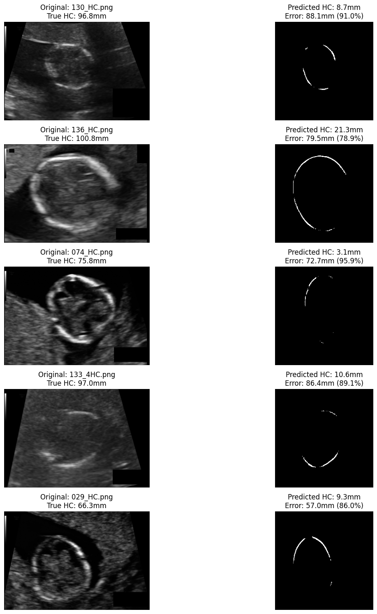

# CSE465_Spring2025_Group-5
This project aims to predict fetal growth throughout pregnancy using ultrasound images. By leveraging deep learning techniques, the model analyzes fetal abdomen circumference (AC) images to assist in monitoring fetal development


# **Fetal Growth Throughout Pregnancy Using Ultrasound Images**

## Contributions

I am alone in this group .

## Data Augmentation Methods

To improve model performance and prevent overfitting, I applied several data augmentation techniques, including:

- **Rotation**: Random rotations within a specified range to enhance orientation invariance.  
- **Flipping**: Horizontal and vertical flipping to simulate different viewpoints of the images.  
- **Zooming**: Random zooming to account for various levels of proximity.  
- **Translation**: Shifting images along both axes to simulate positional variations of the fetus.  
- **Brightness Adjustment**: Random brightness changes to help the model generalize across different exposure levels.  
- **Noise Injection**: Adding random noise to enhance robustness against noisy data.  

## Model Training & Validation  

I trained the dataset using the **UNet model** and evaluated its performance using **Dice coefficient** and **Intersection over Union (IoU)** scores. However, the model performed poorly on the test set, failing to predict meaningful masks. To improve this, I plan to implement a **5-fold cross-validation** approach for better generalization. Below is the validation result so far:  

<<<<<<< HEAD
=======
## Model Architecture
**HRNet (High-Resolution Network)**  
- Input shape: (256, 256, 1)  
- Output: Binary mask (sigmoid activation)  
- Loss: BCE-Dice Loss (`bce_dice_loss = BCE + (1 - dice_coef)`)  
- Optimizer: Adam (lr=1e-4)  

## Training Performance
| Metric              | Training | Validation | Test     |
|---------------------|----------|------------|----------|
| **Accuracy**        | 0.9887   | 0.9855     | 0.9836   |
| **Dice Coefficient**| 0.3697   | 0.2424     | 0.2447   |
| **Loss**           | 0.6734   | 0.8151     | 0.8093   |

**Best Validation Dice**: 0.2527 (Epoch 36)
  


---

## Head Circumference Measurement Results
**Test Set (n=150 samples)**  
| Metric                     | Value       |
|----------------------------|-------------|
| Mean Absolute Error        | 119.30 mm   |
| Median Absolute Error      | 116.63 mm   |
| Mean Percentage Error      | 68.69%      |
| Standard Deviation         | 54.95 mm    |



### Example Predictions



*(Left: Original image, Right: Predicted mask with HC measurement)*

---

## How to Reproduce
1. **Clone the repository**:
   ```bash
   git clone https://github.com/yourusername/hc-prediction.git
   cd hc-prediction
>>>>>>> 11a6c2f1ce16727af92db9822a4b9a7f9d2360b2
  

  
