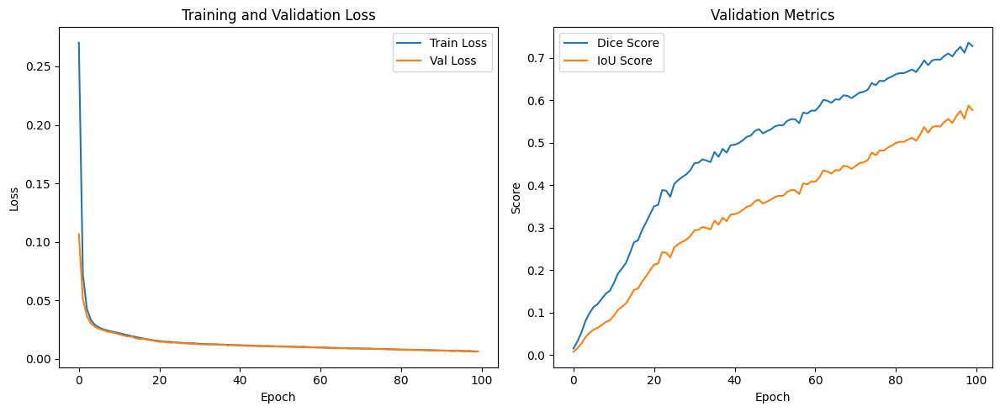

# CSE465_Spring2025_Group-5
This project aims to predict fetal growth throughout pregnancy using ultrasound images. By leveraging deep learning techniques, the model analyzes fetal abdomen circumference (AC) images to assist in monitoring fetal development

# **Fetal Growth Throughout Pregnancy Using Ultrasound Images**

## Contributions

I am alone in this group so no contribution of groupmaets

## Data Augmentation Methods

To improve model performance and prevent overfitting, I applied several data augmentation techniques, including:

- **Rotation**: Random rotations within a specified range to enhance orientation invariance.  
- **Flipping**: Horizontal and vertical flipping to simulate different viewpoints of the images.  
- **Zooming**: Random zooming to account for various levels of proximity.  
- **Translation**: Shifting images along both axes to simulate positional variations of the fetus.  
- **Brightness Adjustment**: Random brightness changes to help the model generalize across different exposure levels.  
- **Noise Injection**: Adding random noise to enhance robustness against noisy data.  

## Model Training & Validation  

I trained the dataset using the **UNet model** and evaluated its performance using **Dice coefficient** and **Intersection over Union (IoU)** scores. However, the model performed poorly on the test set, failing to predict meaningful masks. To improve this, I plan to implement a **5-fold cross-validation** approach for better generalization. Below is the validation result so far:  

  

## Final Plan 

Moving forward, I plan to experiment with advanced segmentation models such as **HRNet, DeepLabV3+, and GNU-Net** to achieve better predictions. For this course, I will complete the project up to this stage. However, beyond this, I intend to apply these models to my **own collected fetal growth ultrasound images**, a process that is currently underway.  
